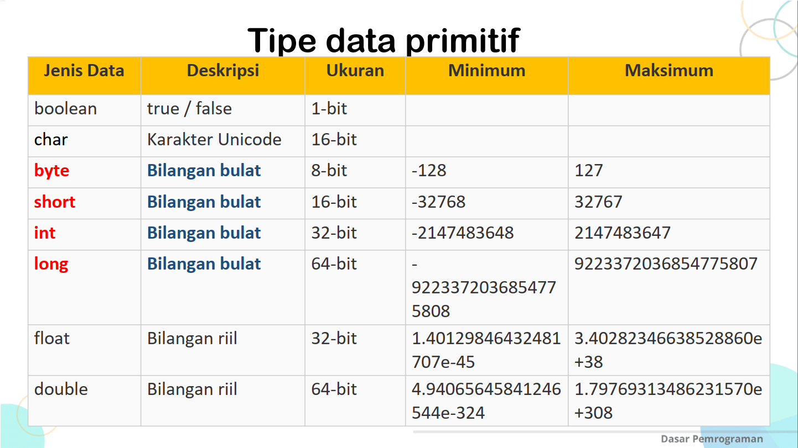
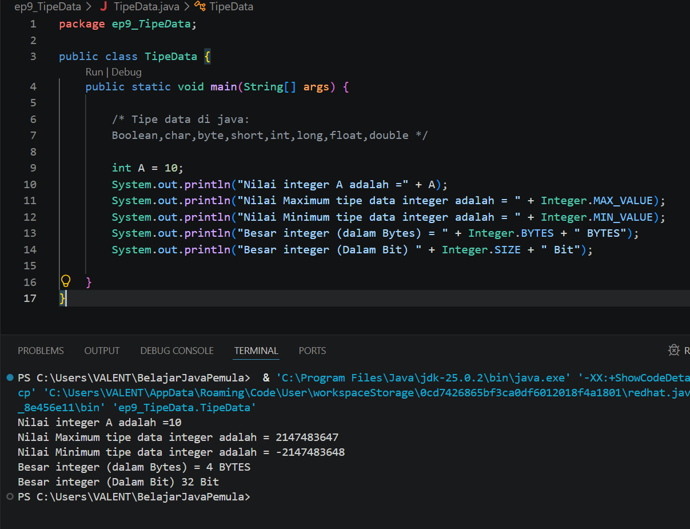
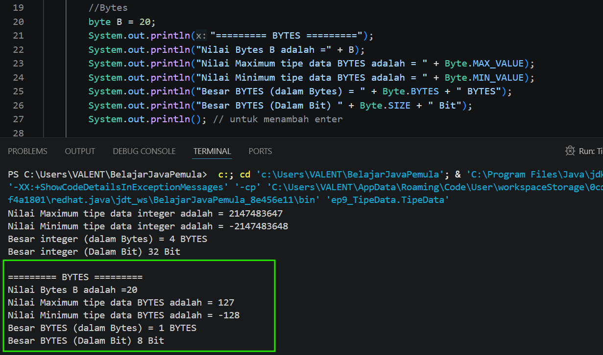
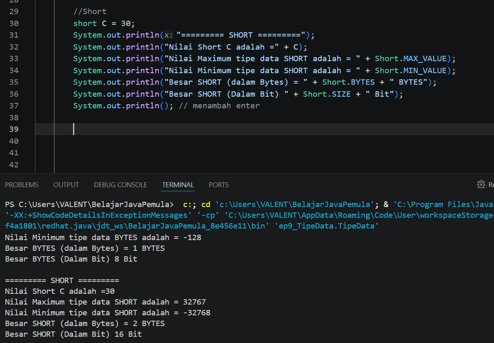
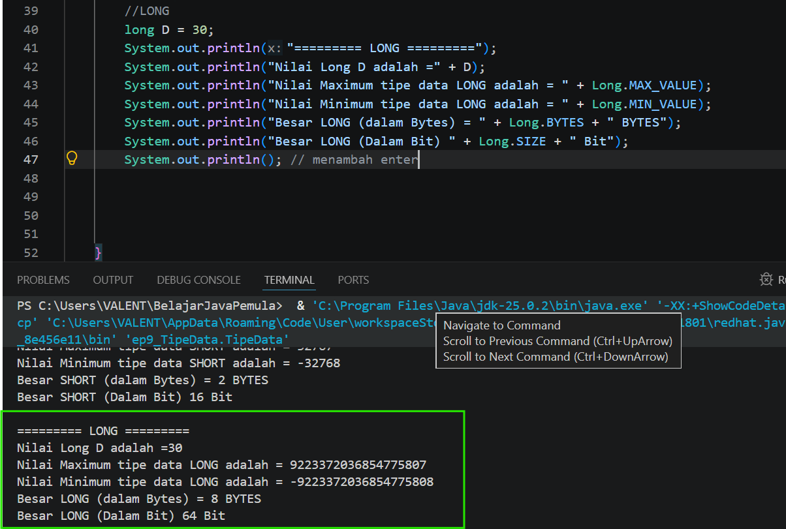
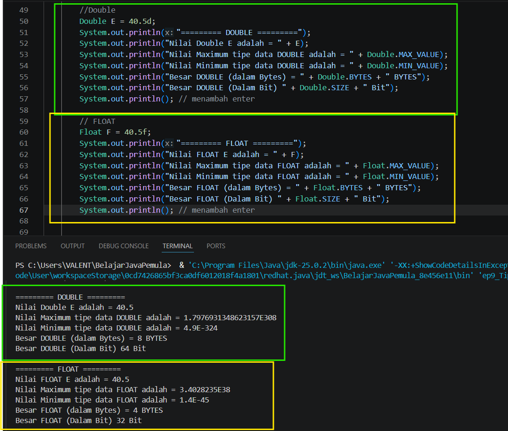
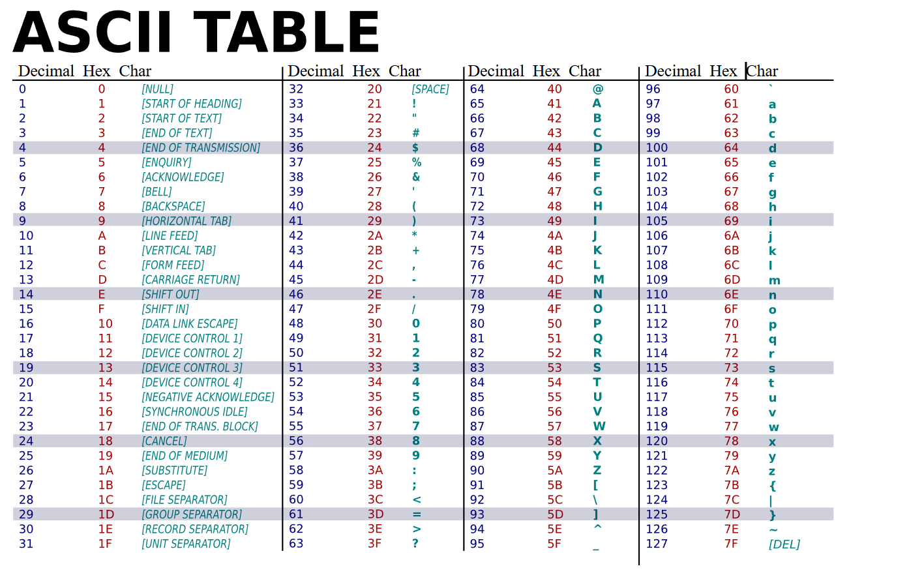
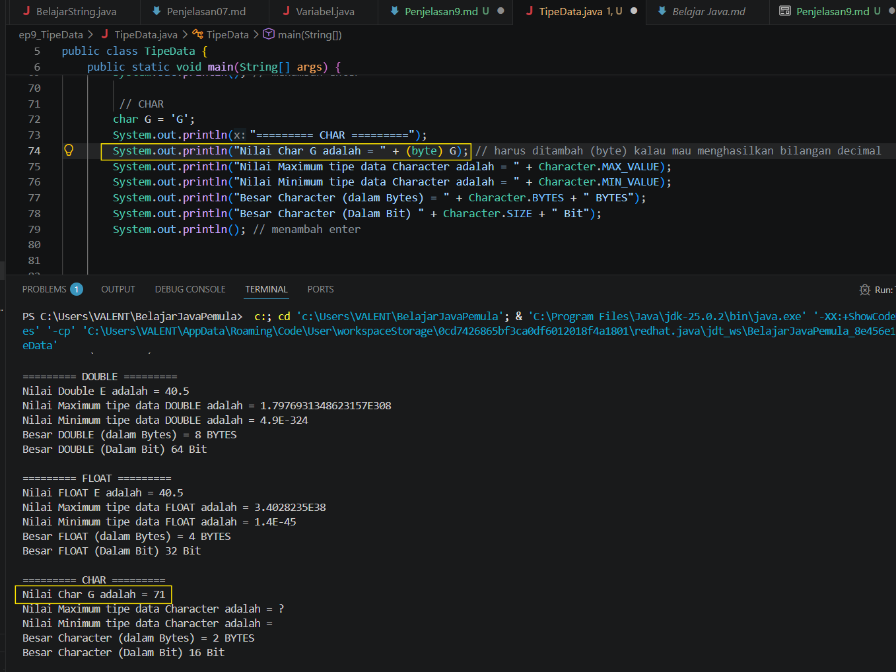
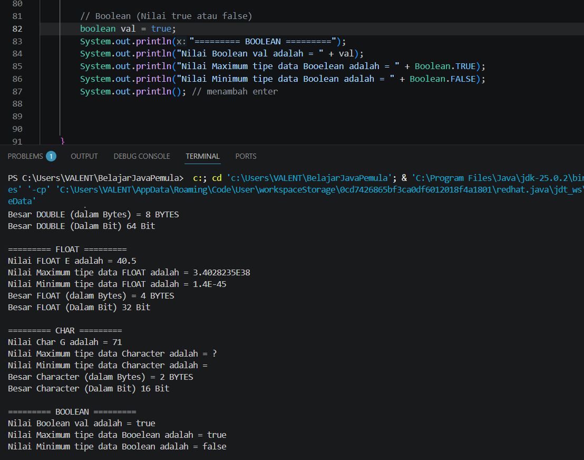

# 09 - Tipe data fundamental atau Primitive

## 1. Tipe data primitif
ada macam macam tipe data primitif ini,yaitu: ```boolean,char,byte,short,int,long,float,double ```


### - Integer
ineteger adalah untuk tipe data yang paling sering digunakan,int itu untuk bilangan bulat yang ukuran nya bisa mencapai 32-bit,atau kita juga bisa melihat jumlah maksimum dan minimum tipe data integer menggunakan kode print seperti ini:
```
System.out.println(Integer.MAX_VALUE);
System.out.println(Integer.MIN_VALUE);
System.out.println(Integer.BYTES);
System.out.println(Integer.SIZE);
```

maka hasilnya adalah seperti berikut:


Nah kenapa hasil maksimum dari integer adalah ``` 2147483647 ``` ? itu karena hasil maksimum dari bit nya integer adalah 32 bit (1 BYTES itu kan 8 bit,jadinya kalau maximum nya 4 bytes maka bit nya dikali 8 jadi 32 bit),kan bit itu memakai biner yaitu ``` [0,1] ```,kan biner cuman ada 2 angka doang kan? makannya kita akan pakai rumus ```2^32-1``` lalu dibagi 2 (32 nya dari bytes itu) dan hasilnya adalah ```2147483647```

### BYTES
sebenarnya bytes sama int ini sama sama untuk mendeklarasikan bilangan bulat,hanya saja MIN dan MAX untuk tipe data nya berbeda,kalau Int maksimum adalah 4 bytes,maka bytes ya sesuai namanya,yaitu 1 doang,kalau mau di implementasikan ke kode program tinggal salin aja kode integer di atas dan ubah ``` integer``` nya jadi ``` byte ``` seperti ini:
```
System.out.println(Byte.MAX_VALUE);
System.out.println(Byte.MIN_VALUE);
System.out.println(Byte.BYTES);
System.out.println(Byte.SIZE);
```
maka hasilnya adalah seperti ini:


nah keuntungan dari byte ini adalah ukuran memori nya lebih kecil dari integer,jadi kalau mau menyimpan memori yang kecil ya pakai bytes aja 

### Short
sama aja kayak bytes dan integer,cuman beda MAX dan MIN nya doang,pakai kode ini:
```
System.out.println(Short.MAX_VALUE);
System.out.println(Short.MIN_VALUE);
System.out.println(Short.BYTES);
System.out.println(Short.SIZE);
```
maka hasilnya adalah:


### Long
sama seperti bytes,short dan integer,long ini MAX dan MIN nya paling gede,ini buat menyimpan memori yang besar,kode nya adalah:
```
System.out.println(long.MAX_VALUE);
System.out.println(long.MIN_VALUE);
System.out.println(long.BYTES);
System.out.println(long.SIZE);
```

maka hasilnya adalah:


### FLOAT dan DOUBLE
nah kalau yang di atas adalah tipe data yang menyimpan bilangan bulat,kalau ini adalah tipe data yang menyimpan bilangan koma,kode nya pun hampir sama seperti ini:
```
System.out.println(Float.MAX_VALUE);
System.out.println(Float.MIN_VALUE);
System.out.println(Float.BYTES);
System.out.println(Float.SIZE);
```
dan 
```
System.out.println(Double.MAX_VALUE);
System.out.println(Double.MIN_VALUE);
System.out.println(Double.BYTES);
System.out.println(Double.SIZE);
```
maka hasilnya adalah seperti ini:


kalo kita perhatikan saya menaruh huruf d pada double dan f untuk float karena agar program tau mana yang float atau double,dan juga kita memakai titik sebagai pengganti koma di program java

### Char
Char ini tipe data yang bisa memuat Variabel Komad dan bilangan real berdasarkan ASCII,berikut adalah tabel ASCII:

jadi misal kita akan membuat Char ``` G ``` maka akan mengeluarkan hasil Decimal seperti berikut:


nah karena Char ``` G ``` nilai decimal nya adalah 71 seperti yang di dalam tabel,makannya akan muncul di terminal output nya 71,dan untuk kenapa MAX dan MIN nya char nya tidak muncul?aslinya nilai MAX dari char adalah 65535,hanya saja di dalam unicode,65535 kan tidak ada?jadi nya terminal gak tau cara menampilkan nya dan memberi simbol tanda tanya,sedangkan MIN nya itu 0 alias null,makannya hasilnya kosong

### Boolean
boolean itu untuk tipe data untuk menampilkan 2 pilihan saja yaitu benar atau salah,oleh karena itu tidak ada nilai MAX dan MIN nya dalam boolean ini,seperti ini:

untuk penjelasan lebih lanjut mengenai boolean akan kita bahas di pelajaran berikutnya

## 📝 Kuis Java Dasar: Tipe Data Fundamental (Primitive)

Uji pemahamanmu mengenai jenis-jenis tipe data primitif di Java, ukuran memori (bytes/bits), nilai maksimum-minimum, serta karakteristik masing-masing tipe data.

Pilih jawabanmu terlebih dahulu, lalu klik tombol **Lihat Kunci Jawaban & Pembahasan** untuk memeriksa hasil pilihanmu!

---

### 1. Di dalam pemrograman Java, apa yang dimaksud dengan tipe data "Primitive" atau fundamental?
- [ ] A. Tipe data yang dibuat sendiri oleh programmer menggunakan class.
- [ ] B. Tipe data bawaan Java yang nilainya langsung disimpan di dalam memori secara efisien dan tidak memiliki method bawaan.
- [ ] C. Tipe data khusus yang hanya digunakan untuk menyimpan file gambar atau audio.
- [ ] D. Tipe data kuno yang sudah tidak direkomendasikan lagi untuk digunakan.

<details>
  <summary><b>👁️ Klik di sini untuk melihat Kunci Jawaban & Pembahasan</b></summary>

  **Jawaban yang Benar:** **B**
  
  *Pembahasan:* Tipe data primitif adalah tipe data standar/bawaan paling dasar di Java yang langsung menyimpan nilainya secara literal di memori (bukan berupa objek/referensi) sehingga performanya sangat cepat.
</details>

---

### 2. Manakah di bawah ini kelompok tipe data primitif yang digunakan khusus untuk menyimpan angka bulat (tanpa koma desimal)?
- [ ] A. float, double, char
- [ ] B. boolean, char, byte
- [ ] C. byte, short, int, long
- [ ] D. int, long, float, double

<details>
  <summary><b>👁️ Klik di sini untuk melihat Kunci Jawaban & Pembahasan</b></summary>

  **Jawaban yang Benar:** **C**
  
  *Pembahasan:* Java menyediakan 4 jenis tipe data primitif khusus untuk bilangan bulat, yaitu `byte`, `short`, `int`, dan `long`. Perbedaan keempatnya terletak pada ukuran memori dan jangkauan nilai yang bisa ditampung.
</details>

---

### 3. Berapakah ukuran memori yang dialokasikan oleh Java ketika kita mendeklarasikan variabel dengan tipe data `int`?
- [ ] A. 1 Byte (8 bit)
- [ ] B. 2 Byte (16 bit)
- [ ] C. 4 Byte (32 bit)
- [ ] D. 8 Byte (64 bit)

<details>
  <summary><b>👁️ Klik di sini untuk melihat Kunci Jawaban & Pembahasan</b></summary>

  **Jawaban yang Benar:** **C**
  
  *Pembahasan:* Tipe data `int` (integer) secara bawaan mengambil ruang memori sebesar 4 Byte atau setara dengan 32 bit di dalam RAM komputer.
</details>

---

### 4. Jika kamu ingin menghemat penggunaan memori RAM pada sebuah array angka bulat yang nilainya dipastikan tidak akan pernah melebihi angka 100, tipe data primitif mana yang paling tepat dipilih?
- [ ] A. long
- [ ] B. int
- [ ] C. short
- [ ] D. byte

<details>
  <summary><b>👁️ Klik di sini untuk melihat Kunci Jawaban & Pembahasan</b></summary>

  **Jawaban yang Benar:** **D**
  
  *Pembahasan:* Tipe data `byte` hanya memakan memori sebesar 1 Byte (8 bit) dengan jangkauan nilai dari -128 hingga 127. Karena nilai yang ingin disimpan tidak melebihi 100, `byte` adalah pilihan paling hemat memori dibandingkan `int` atau `long`.
</details>

---

### 5. Tipe data primitif mana yang memiliki ukuran memori paling besar (8 Byte / 64 bit) di kelompok bilangan bulat?
- [ ] A. int
- [ ] B. long
- [ ] C. double
- [ ] D. short

<details>
  <summary><b>👁️ Klik di sini untuk melihat Kunci Jawaban & Pembahasan</b></summary>

  **Jawaban yang Benar:** **B**
  
  *Pembahasan:* `long` adalah tipe data bilangan bulat terbesar dengan ukuran 8 Byte (64 bit). Pilihan C (`double`) juga berukuran 8 Byte, namun `double` masuk ke kelompok bilangan desimal/pecahan (*floating point*), bukan bilangan bulat.
</details>

---

### 6. Kelompok tipe data pecahan atau desimal (*Floating Point*) di Java diwakili oleh tipe data apa saja?
- [ ] A. float dan double
- [ ] B. int dan float
- [ ] C. double dan long
- [ ] D. short dan pecahan

<details>
  <summary><b>👁️ Klik di sini untuk melihat Kunci Jawaban & Pembahasan</b></summary>

  **Jawaban yang Benar:** **A**
  
  *Pembahasan:* Untuk menyimpan bilangan real atau desimal yang mengandung koma, Java menyediakan dua tipe data primitif, yaitu `float` (berukuran 4 Byte / presisi tunggal) dan `double` (berukuran 8 Byte / presisi ganda).
</details>

---

### 7. Di dalam video dijelaskan bahwa secara bawaan (*default*), jika kita menuliskan angka desimal langsung (contoh: `3.14`), Java akan menganggap angka tersebut bertipe data apa?
- [ ] A. float
- [ ] B. double
- [ ] C. int
- [ ] D. String

<details>
  <summary><b>👁️ Klik di sini untuk melihat Kunci Jawaban & Pembahasan</b></summary>

  **Jawaban yang Benar:** **B**
  
  *Pembahasan:* Java menganggap semua literal desimal secara otomatis sebagai `double`. Jika kita ingin memaksa angka desimal tersebut bertipe `float`, kita harus menambahkan huruf 'f' atau 'F' di belakang angkanya (contoh: `3.14f`).
</details>

---

### 8. Tipe data primitif yang digunakan untuk menyimpan satu buah karakter tunggal (seperti huruf, angka, atau simbol) dan dibungkus dengan tanda petik tunggal adalah...
- [ ] A. String
- [ ] B. boolean
- [ ] C. char
- [ ] D. byte

<details>
  <summary><b>👁️ Klik di sini untuk melihat Kunci Jawaban & Pembahasan</b></summary>

  **Jawaban yang Benar:** **C**
  
  *Pembahasan:* `char` (character) digunakan untuk menampung satu karakter tunggal berbasis kode ASCII/Unicode dengan ukuran memori 2 Byte. Penulisan nilainya wajib menggunakan petik tunggal, contoh: `'A'`. Tipe data `String` bisa menampung banyak huruf/kalimat, tetapi `String` bukan tipe data primitif melainkan tipe data *Object/Reference*.
</details>

---

### 9. Tipe data primitif yang hanya memiliki dua kemungkinan nilai, yaitu benar (*true*) atau salah (*false*), disebut dengan...
- [ ] A. char
- [ ] B. boolean
- [ ] C. binary
- [ ] D. int

<details>
  <summary><b>👁️ Klik di sini untuk melihat Kunci Jawaban & Pembahasan</b></summary>

  **Jawaban yang Benar:** **B**
  
  *Pembahasan:* `boolean` adalah tipe data logika yang hanya dapat menyimpan nilai berupa *keyword* literal `true` atau `false`. Tipe data ini biasanya berukuran 1 bit (secara efisiensi logika).
</details>

---

### 10. Di dalam kode program Java, bagaimana cara termudah untuk mengetahui nilai maksimum atau minimum dari tipe data primitif (misalnya tipe data `Integer`) secara otomatis tanpa perlu menghafalnya?
- [ ] A. Menggunakan perintah `System.out.println(Integer.MAX_VALUE);`
- [ ] B. Menggunakan perintah `System.out.println(int.max);`
- [ ] C. Menghitung manual menggunakan rumus matematika di dalam terminal.
- [ ] D. Menggunakan fungsi `System.out.println(args[0]);`

<details>
  <summary><b>👁️ Klik di sini untuk melihat Kunci Jawaban & Pembahasan</b></summary>

  **Jawaban yang Benar:** **A**
  
  *Pembahasan:* Seperti dicontohkan di video, Java menyediakan *Wrapper Class* untuk setiap tipe data primitif (seperti `Integer` untuk `int`, `Byte` untuk `byte`, dll.). Kita bisa memanggil properti `.MAX_VALUE` atau `.MIN_VALUE` dari *wrapper class* tersebut untuk mencetak batas nilai memori ke layar console.
</details>


